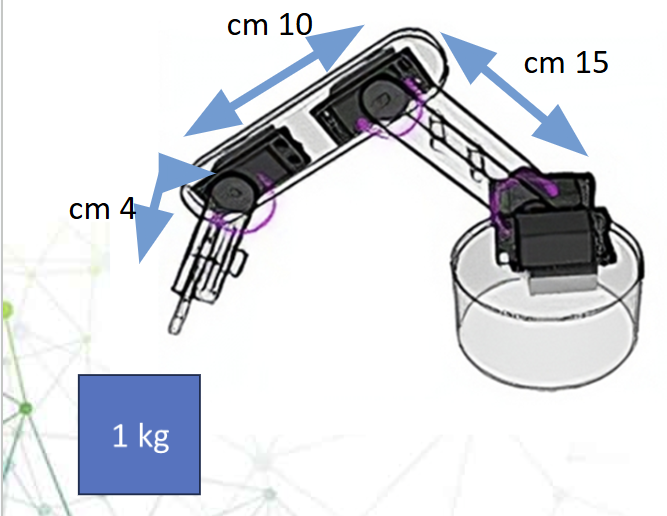

# 🦾 Robotic Arm Torque Analysis & Motor Selection

## Project Overview

This project demonstrates the fundamental calculations required to determine appropriate servo motors for a 3-joint robotic arm. This analysis covers torque calculations, motor selection criteria, and solutions for handling increased payload requirements.



## Robotic Arm Specifications

- **Upper Arm Length**: 15 cm
- **Lower Arm Length**: 10 cm
- **Wrist Length**: 4 cm
- **Base Payload**: 1 kg
- **Extended Payload**: 2 kg (with modifications)

---

## Part 1: Torque Calculation Fundamentals

### Basic Physics Formula

Torque calculation is based on the fundamental physics equation:

```
τ = F × r
```

Where:
- **τ (tau)** = Torque in Newton-meters (N·m)
- **F** = Force in Newtons (N) 
- **r** = Distance from rotation axis to load center (m)

### Converting Weight to Force

For our 1 kg payload:
```
Force = Mass × Gravity = 1 kg × 9.81 m/s² = 9.81 N
```

### Joint-by-Joint Analysis

#### Joint 1 (Base/Shoulder Joint)
- **Load Distance**: 15 + 10 + 4 = 29 cm = 0.29 m
- **Torque Calculation**: τ₁ = 9.81 N × 0.29 m = **2.84 N·m**
- **Converted to kg·cm**: 2.84 × 10.197 = **29 kg·cm**

#### Joint 2 (Elbow Joint)
- **Load Distance**: 10 + 4 = 14 cm = 0.14 m  
- **Torque Calculation**: τ₂ = 9.81 N × 0.14 m = **1.37 N·m**
- **Converted to kg·cm**: 1.37 × 10.197 = **14 kg·cm**

#### Joint 3 (Wrist Joint)
- **Load Distance**: 4 cm = 0.04 m
- **Torque Calculation**: τ₃ = 9.81 N × 0.04 m = **0.39 N·m** 
- **Converted to kg·cm**: 0.39 × 10.197 = **4 kg·cm**

---

## Motor Selection Criteria

### Selected Servo Motors

| Joint | Required Torque | Selected Motor | Motor Torque | Safety Margin |
|-------|----------------|----------------|--------------|---------------|
| Joint 1 | 29 kg·cm | **MG995** | 35 kg·cm | 20% |
| Joint 2 | 14 kg·cm | **MG996R** | 18 kg·cm | 28% |
| Joint 3 | 4 kg·cm | **SG90** | 6 kg·cm | 50% |

---

## Part 2: Scaling to 2 kg Payload

### Recalculated Torque Requirements

When payload increases to 2 kg, torque requirements double:

| Joint | New Torque Requirement | Current Motor Capacity | Status |
|-------|----------------------|----------------------|---------|
| Joint 1 | **58 kg·cm** | 35 kg·cm | ❌ Insufficient |
| Joint 2 | **28 kg·cm** | 18 kg·cm | ❌ Insufficient |
| Joint 3 | **8 kg·cm** | 6 kg·cm | ⚠️ Marginal |

### Gear Reduction Solution

To achieve the required torque with existing motors, gear reduction systems are necessary:

**Joint 1 (Base)**
- **Required Gear Ratio**: 58 ÷ 35 = 1.66:1 → **Use 2:1 planetary gears**
- **Final Torque Output**: 35 × 2 = 70 kg·cm ✅

**Joint 2 (Elbow)** 
- **Required Gear Ratio**: 28 ÷ 18 = 1.56:1 → **Use 2:1 planetary gears**
- **Final Torque Output**: 18 × 2 = 36 kg·cm ✅

**Joint 3 (Wrist)**
- **Current capacity sufficient with minor upgrade to MG90S (9 kg·cm)**

---

## Limitations of Gear Reduction Approach

### Primary Disadvantages

**1. Reduced Speed Performance**
- Speed reduction proportional to gear ratio
- 2:1 gears result in 50% speed reduction
- Slower arm movement affects operational efficiency

**2. Increased System Complexity**
- Additional mechanical components increase failure points

**3. Added Weight and Size**
- Gearboxes increase overall joint mass

---

## Alternative Solutions

### Solution 1: Higher Torque Motors

**Recommended Upgrades:**
- Joint 1: **DS3225** (25 kg·cm) with 3:1 gears → 75 kg·cm
- Joint 2: **DS3225** (25 kg·cm) with 2:1 gears → 50 kg·cm  
- Joint 3: **MG996R** (18 kg·cm) - direct drive

**Advantages:**
- Better speed-to-torque ratio
- Reduced gear ratios needed
- More robust motor construction

### Solution 2: Design Optimization

**Structural Modifications:**
- **Arm Length Reduction**: Decrease upper arm and lower arm .
- **Material Selection**: Use carbon fiber or aluminum alloy for lighter construction
- **Counterweight System**: Add balancing weights to reduce joint loads

**Benefits:**
- Significantly reduced torque requirements
- Maintains existing motor selection
- Improved overall system dynamics

---
